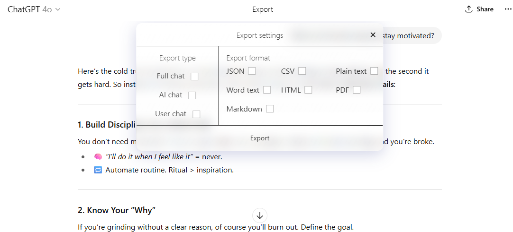

# ChatGPT Export Chrome Extension

A free and open source Chrome extension that lets you export individual ChatGPT conversations. ChatGPT provides a way to download all chats, but this tool adds an **Export** button to each conversation so you can save just what you need.

## Features
- Export all messages, only assistant replies, or only user prompts
- Download conversations as JSON, CSV, plain text, HTML, Markdown, Microsoft Word, or PDF
- Simple interface that integrates directly into the ChatGPT page

## Example 

## Installation
1. Clone or download this repository.
2. Open Chrome and navigate to `chrome://extensions`.
3. Enable **Developer mode** in the top-right corner.
4. Click **Load unpacked** and select the folder containing this project.

## Usage
1. Open any ChatGPT conversation.
2. Click the **Export** button in the conversation header.
3. Choose which messages and format to export.

## Roadmap
- ✅ Current: Export entire chat or just user/AI messages
- 🛠️ **Next up**:
  - Export a **single message** directly
  - Allow **selecting multiple specific messages** for export

## Contributing
Contributions are welcome! Feel free to open issues or submit pull requests to improve the extension.

## License
This project is distributed under the [GNU General Public License v3.0](LICENSE).

## Disclaimer
This project is a work in progress and is not affiliated with OpenAI.
